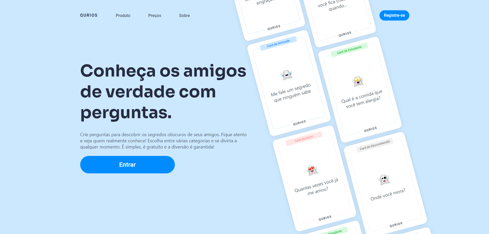

<div align="center">
  
</div>

<h1 align="center" style="display: flex; align-items: center; justify-content: center; gap: 1rem;">Qurios</h1>

<h4 align="center">
  Crie perguntas para descobrir os segredos obscuros de seus amigos. Fique atento e veja quem realmente conhece! Escolha entre várias categorias e se divirta a qualquer momento.
</h4>

<p align="center">
  <a href="#-tecnologias">Tecnologias</a>&nbsp;&nbsp;&nbsp;|&nbsp;&nbsp;&nbsp;
  <a href="#-como-executar">Como executar</a>&nbsp;&nbsp;&nbsp;
</p>

## 👨‍💻 Projeto

Foi usado no projeto React + Typescript onde foi desenvolvido uma "rede social" para pessoas que querem fazer perguntas e compartilhar com amigos secretamente. O nome **Qurios** vem de _Question_ + _Curios_.

## 🧪 Tecnologias

Foram usadas as seguintes tecnologias:

- React
- Typescript
- Eslint
- Axios
- Zod
- React Hook Form
- React Modal
- React Select
- React Router DOM
- Lucide-react (icons)
- Stitches

## 🧑‍🔧 Funcionalidades

Algumas das funcionalidades propostas no desafio

- Autenticar e criar conta
- Ver pergutnas feitas por outros usuários
- Criar perguntas para outras pessoas respoderem
- Criar, editar e excluir perguntas

## 🚀 Como executar

### Primeiro siga os passos do backend.

[Link](https://github.com/fabriciolak/qurios-backend)

Faça um clone do projeto e acesse a pasta criada.

```
git clone https://github.com/fabriciolak/qurios.git
```

```
cd ignite-shop
```

Para iniciá-lo, siga os passos abaixo:

## 👾 Instalar as dependências

Aliases: `i`

```
  npm install
```

## 😎 Iniciar o projeto

```
  npm run dev
```

<a href="https://www.figma.com/file/kJX0eJI4OLxasc9ALO2LvQ/Ignite-Shop-2.0-(Copy)" target="_blank">Ignite Shop</a>

<h1 align="center">
  <a href="https://www.github.com/fabriciolak">
    
  </a>
</h1>
